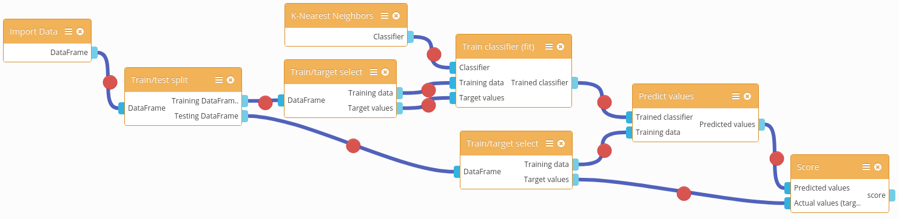

# Need

Businesses and governments have a lot of data, and want to learn about structures and patterns in the data. This might include being able to make predictions extending from the data.

# Use case examples

## Time-series analysis
Companies, research organizations, governments, etc. often collect data/observations containing timestamps. It is useful in many cases to find trends or patterns in data over time, including the possibility to forecast future trends. These types of analyses fall under the umbrella of **time series analysis**.

Specific examples include:
- enterprise resource planning and management
  - staff
  - servers/compute resources
  - supply chain
- environmental monitoring

- https://blog.newrelic.com/2016/11/16/dynamic-baseline-alerts/

## Anomoly detection
We can search for values that stand out of the normal range, or variance, in medium or large data sets. These 'abnormal' data may point to problems or unique conditions, which need attention. Anomoly detection algorithms can help decision makers quickly find unusual segments of data.

Specific examples include:
- fraud detection
- server monitoring and alerting

### Related resources
- http://scikit-learn.org/stable/modules/outlier_detection.html
- https://aqibsaeed.github.io/2016-07-17-anomaly-detection/

# Situation
There are myriad tools to help people design Machine Learning workflows. However, there does not appear to be a visual programming environment with machine learning primitives.

# Goal
Build a general purpose machine learning programming environment that is accessible by a REST API and web user interface.

# Design

The design will most likely consist of a REST API and User Interface, developed as separate components.

A REST API would make it easy to use Machine Learning algorithms, since users would not have to install or maintain the ML software.

The user interface for machine learning algorithms will make it easy for people with little programming experience to build machine learning services. The UI should include interface for interacting with data, sequencing ML tasks, and accessing output. It might also include basic visualizations to give users insight into data (histogram, etc)

# Roadmap

- Sketch out REST API using design-first API tool
    - seek feedback on API design from Orange3 developers, APInf team, ML community
- Create wireframe, and possibly mockups, of User Interface
- Research/choose framework(s) and libraries to commence development
    - REST framework
    - UI framework (if applicable)
    - Visualization framework (if applicable)
- Scaffold initial REST API
- Prototype initial User Interface using UI framework

# API

The API might be structured to mirror the Orange3 User Interface. Specifically, the Orange3 UI has the following structure:

- **Data** - widgets for data handling (import, export, random data generation, processing etc)
- **Visualize** - widgets to represent data in various forms (scatter plot, tree, histogram, etc)
- **Model** - widgets to analyze data and pick predictive algorithm(s)
- **Evaluate** - widgets to test the strength of chosen predictive algorithm(s)
- **Unsupervised** - widgets for selecting unsupervised learning models (probably can be combined under the Model section of the API)

# UI

UI contains features such as:
- Upload .csv file with historical data
- Set the number of traits (hallmarks, set of data was based on predecting)
- Area of output result

# Existing tools

It is worth building on top of existing tools, to make our work more focused. This section outlines relevant tools for building the idea as easily as possible.

## REST framework(s)
- [Eve](http://python-eve.org/rest_api_for_humans.html) is the Simple Way to REST that is based on Flask
- [Connexion](https://github.com/zalando/connexion) Swagger/OpenAPI First framework for Python on top of Flask with automatic endpoint validation & OAuth2 support 

## Machine Learning Framework(s)

- scikit-learn: a popular and consistent API for many machine learning algorithms, written in Python

## Machine Learning User Interface(s)

### Orange3
[Orange3](https://orange.biolab.si/): machine learning user interface with drag and drop modelling, visualization, data management and more.

- based on scikit-learn
- open issue for REST API design: https://github.com/biolab/orange3/issues/1419
- may need a web-based UI widget library

While Orange3 has a user interface, it is based on the Qt framework. This design decision means Orange3 is primarily relegated to Desktop usage. It may be desirable to build a web native user interface, so that no end-user download is necessary (aside from a web browser) to use the software .

## Machine Learning REST Interface(s)
- [Protocols and Structures for Inference Machine Learning as a Service](http://psikit.net/) - an architecture for presenting machine learning algorithms, their inputs (data) and outputs (predictors) as resource-oriented RESTful web services in order to make machine learning technology accessible to a broader range of people than just machine learning researchers.
  - [JavaScript client](https://github.com/psi-project/client)
  - [sklearn wrapper](https://github.com/psi-project/sklearn-wrapper)

## General UI widgets
To build out the overall user interface, we can select an existing JS UI framework, such as:

- [Onsen UI](https://onsen.io/): mobile friendly UI framework with many common widgets
- [jQuery UI](http://jqueryui.com/)

## Graph/data flow widgets
Following the conventions in the Orange3 user interface, ML sequences can be modeled as data flows. To facilitate this type of modelling/interation, we can build on an existing JavaScript UI framework such as the following:

- [mxGraph](https://github.com/jgraph/mxgraph)

## Flow-based programming environments
There are some programming environments that support a flow-based visual workflow. The following examples are open-source, and run in aweb browser:

- [NodeRed](http://nodered.org/) is a browser-based editor that makes it easy to wire together flows using the wide range of nodes in the palette that can be deployed to its runtime in a single-click.
- [WireCloud](https://github.com/Wirecloud/wirecloud) is an end-user centred web application mashup platform aimed at allowing end users without programming skills to easily create web applications and dashboards/cockpits

## Visualization

For similar reasons as the user interface, the visualization framework should be based on web standards. 

A discussion was opened in the [Orange3 repository related to open-source](https://github.com/biolab/orange3/issues/2044), web-based data visualization frameworks.

Proposals for the data visualization framework include:

- [Altair](https://altair-viz.github.io/) - Altair is a declarative statistical visualization library for Python, based on the powerful Vega-Lite visualization grammar.

- [Bokeh](http://bokeh.pydata.org/en/latest/) - Bokeh is a Python interactive visualization library that targets modern web browsers for presentation.

- [Matplotlib D3 (mpld3)](http://mpld3.github.io/) - The  mpld3 project brings together Matplotlib, the popular Python-based  graphing library, and D3js, the popular JavaScript library for creating  interactive data visualizations for the web.

# Resources
- [Standardizing the World of Machine Learning Web Service APIs](http://www.kdnuggets.com/2015/07/psi-machine-learning-web-service-apis.html)
- [Using Flask to serve a machine learning model as a RESTful webservice](https://www.youtube.com/watch?v=s-i6nzXQF3g)
- [Machine Learning Rest API in a Docker](https://juan-medina.com/2015/12/05/machine-learning-docker/)
- [Architecting a Machine Learning System for Risk](https://medium.com/airbnb-engineering/architecting-a-machine-learning-system-for-risk-941abbba5a60)
- [Building a Movie Recommendation Service with Apache Spark & Flask - Part 2](https://www.codementor.io/jadianes/building-a-web-service-with-apache-spark-flask-example-app-part2-du1083854)
